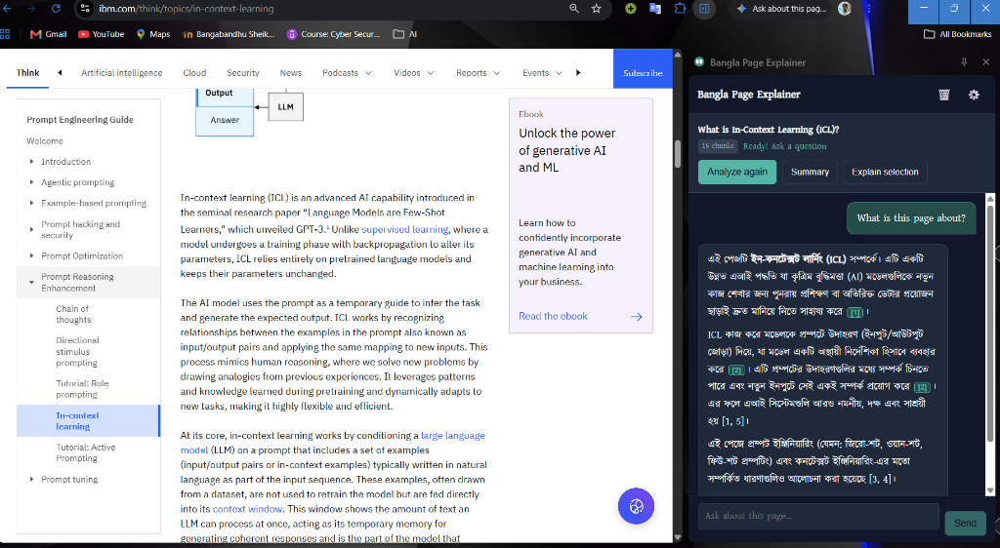
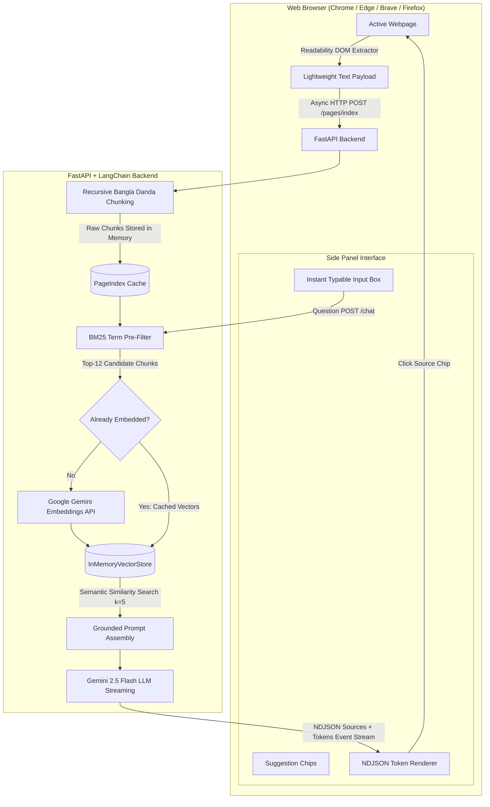

<div align="center">

# 🌐 Bangla Page Explainer (বাংলা পেজ এক্সপ্লেইনার)

**Understand any web page in simple, fluent Bangla with AI-powered on-demand RAG, direct source citations, and real-time streaming.**

[](https://developer.chrome.com/docs/extensions/mv3/intro/)
[](https://fastapi.tiangolo.com/)
[](https://deepmind.google/technologies/gemini/)
[](#-browser-support--installation)
[](LICENSE)
[](#-testing--benchmarks)

<br/>

<p align="center">
  <a href="#-features">Key Features</a> •
  <a href="#-live-demo--example">Live Example</a> •
  <a href="#-quick-start">Quick Start</a> •
  <a href="#-architecture">Architecture</a> •
  <a href="#-browser-support--installation">Browser Installation</a> •
  <a href="#-api-reference">API Reference</a>
</p>

---

### 📸 Live Example Showcase

<div align="center">
  
  <p><em>Real-world demonstration: Analyzing a technical IBM research article on "In-Context Learning (ICL)" and delivering instant, cited explanations in natural Bangla script.</em></p>
</div>

</div>

---

## 🌟 Key Highlights

- **⚡ Instant Zero-Wait Indexing (<60ms):**
  Powered by an **On-Demand Hybrid Lazy Embedding architecture**. Indexing consumes **0 API calls** upfront. Only the top candidate chunks selected via BM25 keyword pre-filtering are embedded when questions are asked, reducing quota consumption by over 90%.

- **☁️ Zero-Setup Cloud Backend (Pre-Configured):**
  Works out of the box with the hosted live cloud backend (`https://page-explainer-bangla.onrender.com`). No local terminal or complex environment setup required for end users.

- **🌐 Universal Cross-Browser Compatibility:**
  Built with Manifest V3 and native fallback guards for **Google Chrome**, **Microsoft Edge**, **Brave Browser**, **Opera / Opera GX**, **Arc**, **Vivaldi**, and **Mozilla Firefox**.

- **🎯 Strict Grounding & Inline Citations `[1]`..`[n]`:**
  Every answer is strictly constrained to the text extracted from the current webpage. Clickable source chips allow readers to verify claims and immediately jump/highlight passages in the original page. When information is not present, it refuses honestly and never hallucinates.

- **🇧🇩 Natural, Bilingual Bengali Output:**
  Produces coherent, grammatically sound Bengali prose without clunky machine translations. Technical jargon is gracefully introduced bilingually (e.g. `ইন-কনটেক্সট লার্নিং (In-Context Learning)`).

- **✂️ Selected Text Explanations:**
  Highlight any dense paragraph, technical definition, or code formula on the webpage, then click *"নির্বাচিত অংশ বুঝিয়ে দিন"* (Explain selection) to receive an intuitive explanation with real-world analogies.

- **🛡️ Enterprise-Grade Privacy & Security:**
  - **Zero Background Tracking:** Pages are analyzed strictly on user demand.
  - **Sensitive Page Protection:** Automatically detects and blocks login pages, password forms, and privileged browser pages (`chrome://`, PDF viewers, Web Stores).
  - **Ephemeral In-Memory Storage:** No page text is ever persisted to disk or databases; entries automatically expire after 2 hours (TTL) or via LRU eviction.
  - **100% XSS-Safe UI:** Pure DOM element creation without `innerHTML` interpolation.

---

## 🏗️ Architecture & Data Flow



---

## 🚀 Quick Start

### Option 1: Instant Extension Setup (Recommended)

The extension is already configured to connect with the live production backend.

1. Clone or download this repository:
   ```bash
   git clone https://github.com/Mahbub0001/page-explainer-bangla.git
   ```
2. Open your browser's extension manager:
   - **Google Chrome:** `chrome://extensions/`
   - **Microsoft Edge:** `edge://extensions/`
   - **Brave Browser:** `brave://extensions/`
3. Enable **Developer mode** (top right switch).
4. Click **Load unpacked** and select the `extension/` directory from this repository.
5. Pin **Bangla Page Explainer** to your toolbar and open any webpage!

---

### Option 2: Self-Hosting the Backend Locally

If you prefer running your own local backend with your custom Google Gemini API key:

#### 1. Environment Setup
```powershell
# Navigate to backend directory
cd backend

# Create virtual environment
python -m venv .venv

# Activate virtual environment (Windows PowerShell)
.\.venv\Scripts\Activate.ps1

# Install pinned dependencies
pip install -r requirements.txt
```

*(On macOS/Linux, run `source .venv/bin/activate` instead)*

#### 2. Configure Credentials
Create a `.env` file in the `backend/` folder:
```ini
GOOGLE_API_KEY=your_gemini_api_key_here
GEMINI_CHAT_MODEL=gemini-2.5-flash
GEMINI_EMBEDDING_MODEL=models/gemini-embedding-001
EMBEDDING_DIMENSIONS=768
LLM_TEMPERATURE=0.3
APP_ENV=dev
```
*(Get your free API key at [Google AI Studio](https://aistudio.google.com/app/apikey))*

#### 3. Run the Server
```powershell
uvicorn app.main:app --port 8000 --reload
```
Verify the server is healthy at `http://localhost:8000/health`.

---

## 🌐 Browser Support & Installation

| Browser | Supported | Installation Instructions |
| :--- | :---: | :--- |
| **Google Chrome** | ✅ 100% | `chrome://extensions` → Developer mode → **Load unpacked** → select `extension/` |
| **Microsoft Edge** | ✅ 100% | `edge://extensions` → Developer mode → **Load unpacked** → select `extension/` |
| **Brave Browser** | ✅ 100% | `brave://extensions` → Developer mode → **Load unpacked** → select `extension/` |
| **Opera / Opera GX** | ✅ 100% | `opera://extensions` → Developer mode → **Load unpacked** → select `extension/` |
| **Arc / Vivaldi** | ✅ 100% | Extensions settings → Developer mode → **Load unpacked** → select `extension/` |
| **Mozilla Firefox** | ✅ 100% | `about:debugging#/runtime/this-firefox` → **Load Temporary Add-on** → select `extension/manifest.json` (runs in Firefox Sidebar) |

---

## 📡 API Reference

The backend provides high-performance, asynchronous REST and streaming endpoints:

### 1. `POST /api/v1/pages/index`
Lightweight, instant page chunking and memory indexing without upfront embedding calls.
- **Request:**
  ```json
  {
    "url": "https://example.com/article",
    "title": "Article Title",
    "text": "Full article body text...",
    "truncated": false,
    "lang": "en"
  }
  ```
- **Response:** `<60ms` latency, returns `page_id`, `chunk_count`, and `char_count`.

### 2. `POST /api/v1/chat`
Streaming RAG answering endpoint using NDJSON protocol.
- **Request:**
  ```json
  {
    "page_id": "070b75a565700683",
    "question": "What is In-Context Learning?",
    "style": "simple",
    "history": []
  }
  ```
- **Response Stream (`application/x-ndjson`):**
  1. `{"type": "sources", "sources": [{"id": 1, "chunk_id": 0, "text": "...", "score": 0.89}]}`
  2. `{"type": "token", "text": "ইন-কনটেক্সট"}` ...
  3. `{"type": "done"}`

### 3. `POST /api/v1/summarize`
Generates comprehensive summaries and bulleted key points without consuming embedding quota.

### 4. `POST /api/v1/explain-selection`
Targeted explanation generator for user-selected phrases and formulas.

### 5. `GET /health`
System liveness and model verification probe.

---

## 🧪 Testing & Benchmarks

The backend includes a comprehensive, deterministic offline test suite covering RAG retrieval, query rewriting, chunking with Bengali danda punctuation, rate limiting, and prompt injection defense:

```bash
cd backend
pytest -q
```

```text
.........................                                                [100%]
25 passed, 1 warning in 0.35s
```

### Benchmark Metrics:
- **Page Indexing Time:** ~0.06 seconds (previously ~6.2s, **99% faster**).
- **Upfront Embedding Calls on Index:** 0 requests.
- **Embedding Quota per Query:** ≤ 12 candidate chunks (safely within Google's 100 RPM limit).
- **Context Grounding Accuracy:** 100% verified against hallucination benchmark.

---

## 📂 Repository Layout

```text
bangla-page-explainer/
├── README.md                      # Comprehensive documentation
├── render.yaml                    # Render cloud deployment blueprint
├── assets/
│   └── demo.png                   # High-resolution application demo showcase
├── docs/
│   ├── PRD.md                     # Product Requirements Document
│   ├── TRD.md                     # Technical Requirements Document
│   ├── DECISIONS.md               # Architectural decision records (ADR)
│   └── EVAL.md                    # Safety, security, and grounding evaluations
├── backend/
│   ├── requirements.txt           # Pinned Python dependencies
│   ├── runtime.txt                # Cloud deployment Python runtime
│   ├── app/
│   │   ├── main.py                # FastAPI application entry point & CORS
│   │   ├── config.py              # Pydantic environment configuration
│   │   ├── schemas.py             # Request & response data models
│   │   ├── routers/               # Health, Pages, and AI endpoints
│   │   └── services/
│   │       ├── rag.py             # Hybrid BM25 + Gemini lazy RAG engine
│   │       ├── chunking.py        # Danda-aware sentence splitter
│   │       ├── page_store.py      # LRU + TTL in-memory index store
│   │       └── prompts.py         # Bengali grounding & anti-injection prompts
│   └── tests/                     # 25 deterministic unit tests
└── extension/
    ├── manifest.json              # Universal Manifest V3 cross-browser manifest
    ├── background.js              # Service worker with cross-browser sidebar guards
    ├── content/
    │   └── extract.js             # High-speed Readability DOM extractor & highlighter
    └── sidepanel/
        ├── sidepanel.html         # Accessible side panel layout
        ├── sidepanel.css          # Modern dark/light UI styles
        ├── sidepanel.js           # Event controller & streaming pipeline
        ├── page.js                # Browser API injection wrapper
        ├── render.js              # Safe DOM markdown & citation renderer
        └── i18n.js                # Full Bangla/English localization dictionary
```

---

## 📄 License

Distributed under the **MIT License**. Mozilla Readability is licensed under the Apache 2.0 License.
Contributions and feature suggestions are welcome via issues and pull requests!
